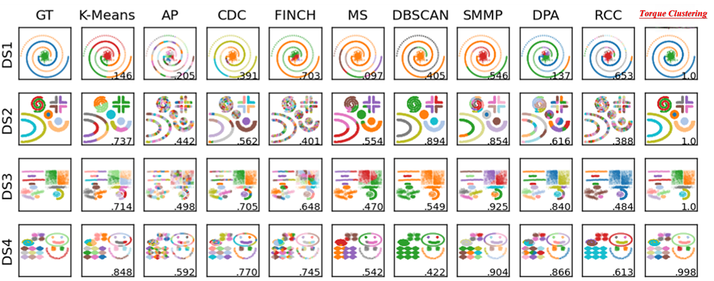

# <h1>The official implementation of Torque Clustering Algorithm</h1>

<h2>Autonomous clustering by fast find of mass and distance peaks</h2>



🚀 New: High-performance TORC MEX (Windows)

We now officially release a faster implementation of Torque Clustering, **TORC.mexw64** (TORC is the official abbreviation of *TORque Clustering*).  
`TORC` has exactly the same function signature and behaviour as `TorqueClustering.p` (same inputs, same outputs), but runs significantly faster in practice.  
You can call `TORC(ALL_DM, K, isnoise, isfig)` in exactly the same way as `TorqueClustering` — enjoy.

<h3>Usage and implementation</h3>

## TorqueClustering Function Usage

The `TorqueClustering` function performs clustering based on a distance matrix. It supports both **automatic cluster number determination** and **manual cluster number specification**.

### Function Signature:
```matlab
[Idx, Idx_with_noise] = TorqueClustering(ALL_DM, K, isnoise, isfig)
```

### Input Arguments:
- **`ALL_DM`** *(n × n matrix)*:  
  The distance matrix of `n` data samples.

- **`K`** *(integer)*:  
  Specifies the number of clusters:
  - `K = 0`: **Automatic mode** – The algorithm automatically determines the number of clusters.
  - `K ≠ 0`: **Manual mode** – The algorithm manually sets the final number of clusters to `K`.

- **`isnoise`** *(0 or 1)*:  
  Determines whether to detect noise clusters:
  - `isnoise = 1`: Detects noise clusters.
  - `isnoise = 0`: No noise detection.

- **`isfig`** *(0 or 1)*:  
  Determines whether to draw the decision graph:
  - `isfig = 1`: Draws the decision graph.
  - `isfig = 0`: Does not draw the graph.

### Output:
- **`Idx`** *(n × 1 array)*:  
  The final cluster labels for each data point.

- **`Idx_with_noise`** *(n × 1 array)*:  
  The cluster labels including noise. Noise points are labeled as `0`.

### Example Usage:
```matlab
% Example 1: Automatic clustering with decision graph
[Idx, Idx_with_noise] = TorqueClustering(DM, 0, 1, 1);

% Example 2: Manual clustering with K = 5 clusters, without noise detection
[Idx, Idx_with_noise] = TorqueClustering(DM, 5, 0, 0);
```

This project is for the reproduction of the accuracy results of the Torque Clustering algorithm as reported in our paper.
 
You need to put all the ".m" files into one folder.

Due to the space limits of Github, we put all the data sets on the [google drive:](https://drive.google.com/file/d/1ddvBAfxtR9wKKM7IAhNfD9HQ_kyhmceD/view?usp=sharing), the txt version of the data sets is also [available:](https://drive.google.com/file/d/1cPz7KvnLCPx-j6nWOl-juOMTtIWlmW3Y/view?usp=sharing).

**You may refer to the file containing "Run" in its name for a detailed guide on how to use Torque Clustering.**

The explanation of each "Run" file:

TorqueClustering_Run.m and TorqueClustering_Run_ImageClustering.m: The codes for the reproduction of the results in the main article.

TorqueClustering_Run_Supplementary.m: The codes for the reproduction of the results in the supplementary information.

⚠️ **Note:**  
- This open-source implementation is provided to allow reproduction of the accuracy results reported in our paper.  
- It is **NOT** intended as an optimized or production-ready version.  
- We plan to release a high-efficiency version of Torque Clustering with parallel processing in the future.

### 🐍 Python Version (Community-Contributed, Unofficial)

A community-contributed Python version can be found here:  
[https://github.com/Cognet-74/TorqueClusteringPy]

We appreciate community efforts to explore the algorithm. 
Please note this version is **unofficial** and may differ from the MATLAB implementation or our original TPAMI paper.
<h3>**Citation**</h3>

If you find our codes useful, please cite our paper:  
**Jie Yang and Chin-Teng Lin, “Autonomous clustering by fast find of mass and distance peaks,” IEEE Transactions on Pattern Analysis and Machine Intelligence (TPAMI), DOI: 10.1109/TPAMI.2025.3535743**  
The pre-print version of this paper is [here](https://www.computer.org/csdl/journal/tp/5555/01/10856563/23Saifm0vLy) and [here](https://www.techrxiv.org/users/686426/articles/679723-autonomous-clustering-by-fast-find-of-mass-and-distance-peaks)

---

## **📜 Code Ownership & Copyright**
All code in this repository was **exclusively written and implemented by Jie Yang**, and the **copyright belongs to Jie Yang**.  

**Unauthorized modification, misattribution of authorship, or commercial use of this code is strictly prohibited under the license terms.**  

For inquiries regarding licensing or collaborations, please contact:  
📩 [jie.yang.uts@gmail.com](mailto:jie.yang.uts@gmail.com).

---
**We welcome academic users to explore and build upon this work, under the terms of the license.**
**Commercial use of the code or the Torque Clustering algorithm is not permitted without explicit permission from the author.**

<h4>**License**</h4>

##### 🚨 License & Forking Policy 🚨
This repository is licensed under **Creative Commons Attribution-NonCommercial-ShareAlike 4.0 International (CC BY-NC-SA 4.0)**.

###### ❌ Prohibition of Commercial Use
- This software **MAY NOT** be used for any **commercial purposes**.
- Any form of **selling, paid services, SaaS deployment, or monetization** based on this repository is **strictly prohibited**.

###### 🔄 Forking Rules
- **You are allowed to fork** this repository, but **you MUST retain this exact license (CC BY-NC-SA 4.0)**.
- **Proper attribution to the original author is required** when using, modifying, or redistributing this repository.
- Any modifications, adaptations, or derivative works **must also be non-commercial and remain under CC BY-NC-SA 4.0**.

###### 🛑 Enforcement of License Violations
- **Violations of these terms may result in a DMCA takedown request filed on GitHub**.
- Any unauthorized **commercial usage or license violations** may lead to **legal actions**.

For further details, please refer to the official [Creative Commons License](https://creativecommons.org/licenses/by-nc-sa/4.0/).
